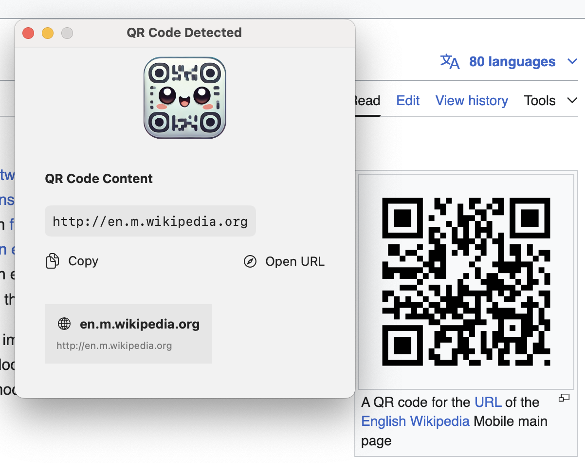

# QR Screen Scanner for macOS

A powerful, native macOS app that lets you scan QR codes directly from your screen. No need to take photos of your monitor - simply scan any QR code visible on your screen with a single click!

## 🚀 Features

- **📱 Screen Area Selection**: Select any area of your screen containing QR codes using a simple dragging interface
- **✨ Smart Mode**: One-click detection highlights all QR codes visible on your screen
- **🔗 URL Handling**: Special handling for URLs with preview and direct browser opening
- **⌨️ Keyboard Shortcuts**: Fast activation with customizable keyboard shortcuts
- **🧭 Menu Bar Integration**: Always accessible from your menu bar
- **🌓 Dark/Light Mode Support**: Seamlessly adapts to your system appearance

## 📥 Installation

1. [Download the latest release](https://github.com/andrewmkhoury/qr-scanner/releases/latest)
2. Open the DMG file and drag the app to your Applications folder
3. Open the app from your Applications folder
4. The app will request screen recording permission which is required for scanning

## 🎮 How to Use

### Basic QR Code Scanning

1. Click the QR code icon in your menu bar
2. Your screen will be scanned for QR codes automatically
3. Click on any detected QR code to view its content

### Smart Mode

Smart Mode automatically detects and highlights all QR codes currently visible on your screen, making it incredibly easy to interact with them.

## 🔒 Privacy

This app values your privacy:
- All scanning happens locally on your machine
- No data is ever sent to any server
- No analytics or tracking
- No internet connection required

## 💻 Development

### Requirements
- macOS 11.0 (Big Sur) or later
- Xcode 12.0 or later for building from source

### Building from Source
1. Clone this repository
2. Open the project in Xcode or build using Swift Package Manager
3. Build and run the app

## 📄 License

This project is licensed under the [Apache License 2.0](LICENSE) - see the LICENSE file for details.

## 🤝 Contributing

Contributions are welcome! Feel free to open issues or submit pull requests.

## 📬 Contact

If you have any questions or feedback, please open an issue on GitHub. 